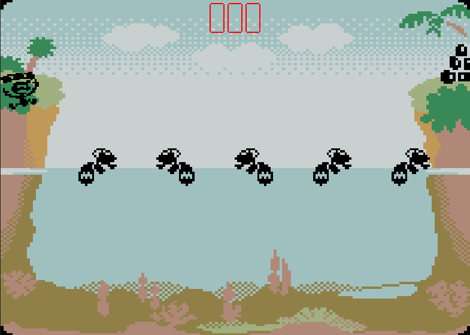

# Turtle Bridge Game
## What is it
A [Turtle Bridge](https://youtu.be/UuVS3wOomGE) game implementation made in pure Java. The player has to take supplies on the left shore and bring them to the right shore, while jumping on turtles that are diving into the water all the time.

## Screenshots

## What's in use
Java only. Java Swing for the GUI part.

## Controls
S - start the game  
A, D - move left / right
